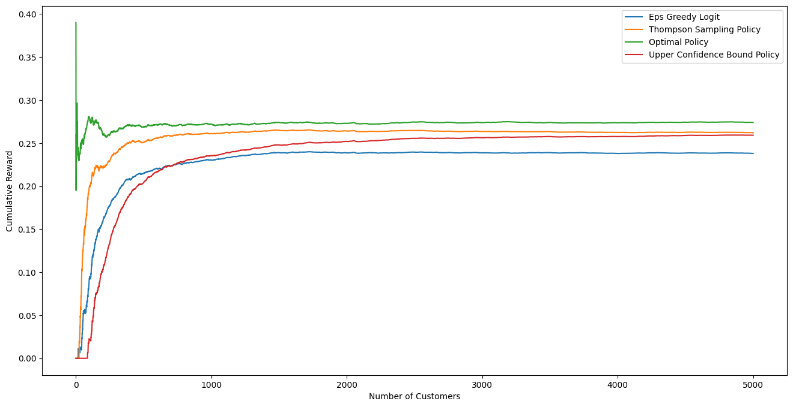

# JAX_simulations

These simulations are implemented with JAX. Developed by Google, Jax is a Python library that is specifically designed for ML research. Unlike Tensorflow and PyTorch, it is built with the functional programming (FP) paradigm, making it highly composable and promoting the concept of pure functions that have no side effects. This means that all state changes, such as parameter updates or splitting of random generators, must be done explicitly. Although this may require more lines of code than their object-oriented programming (OOP) equivalent, it gives developers full control over state changes, leading to an increased understanding of the code and fewer surprises.

Ideas and algorithms behind the simulations can be found here:
https://github.com/xanmendelsohn/Dynamic-Pricing-with-Reinforcement-Learning

## Price Optimization Simulations
### finding optimum individual prices with multi-arm contextual bandit policies

### Price Sensitivity Model

The following curve can be interpreted as a depiction of the likelihood of a given client closing a deal. There are two client groups (orange and blue) with different price sensitivities. Prices range between 0 and 1. 

Each point in the diagram is the average percentage of clients who will accept a deal at price x. The blue client group is more price sensitive.

Each client has a stochastic price threshold (the threshold is normally distributed with mean and standard deviation being fixed per client group). The client accepts the deal if the price falls below this threshold.

    

    

The scatterplot above approximates the curve defined by:
    $$1 - CDF(\mu, \sigma)$$
Where CDF denotes the cumulative distribution function of the normal distribution.

    

    

#### Optimal Price

The price which we optimize for is the price with the highest expected return, i.e. $$ max \mathbb{E}[reward] = argmax_{price} [ price* \mathbb{P}(deal_{price}) ]$$
The plot below depicts the expected return per price and client group and marks the optimal with a vertical line.

    

    

### Simulation of Online Price Optimization

See the white paper for a description of multi-arm contextual bandits and the policies defined below.

Policies compared include:

- Thomspon Sampling
- Epsilon Greedy
- Upper Confidence Bound
- EXP3

All bease-algorithms implement **cross-over learning**, i.e.

- if a deal is lost at price p, lost deals are simulated for all prices >p, ceteris paribus
- if a deal is won at price p, won deals are simulated for all prices <p, ceteris paribus

### Evaluation

#### Reward Evaluation

    

    

#### Regret Evaluation

    

    

